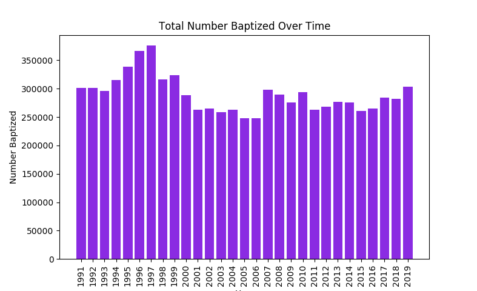
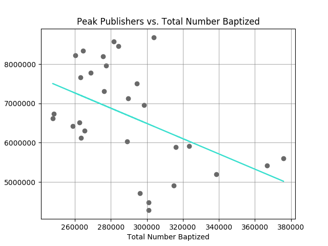

# Statistical Study on Growth of Jehovah's Witnesses
This is a project to find insights on the growth of Jehovah's Witnesses since 1991 using Python Data Science Libraries(pandas,numpy,matplotlib,sk-learn,etc).


## Background

I will study the growth of the organization through a few variables:

* **Peak Publishers**: “Publishers” includes baptized Witnesses of Jehovah as well as unbaptized ones who qualify to be Kingdom preachers. “Peak publishers” is the highest number reporting for any one month of the service year.
* **Average Publishers**: "Average publishers” is the typical number of different ones reporting time in the ministry each month.
* **Total Hours Spent in Field**: The number of people that were baptized in that year. Usually, when a person is baptized, this means they officially join the organization.
* **Total Number Baptized**: The number of people that were baptized in that year. Usually, when a person is baptized, this means they officially join the organization.
* **Memorial Partakers**: The number of baptized individuals who partake of the emblems at the Memorial worldwide.
* **Worldwide Memorial Attendance**: The number of people that attend the Memorial.
* **Total Congregations**: The number of congregations (worship groups) worldwide.
* **Average Bible Studies Each Month**: The typical number of different bible studies taking place each month.


## Data Exploration

We start by importing the necessary libraries.

```python
from sklearn.linear_model import LinearRegression
import matplotlib.pyplot as plt
import numpy as np
import pandas as pd
```

Next I will import data from a table I created with [Watchtower Online Library](https://wol.jw.org/en/wol/d/r1/lp-e/1200275209).

```python
df=pd.read_csv("./data.csv") 
```

The data has eight columns containing the variables listed in the background.

Let's explore each one of these and see what insights we find!


### Peak Publishers, Average Publishers, and Average Bible Studies


```python
plt.plot(year, ppubs, label="Peak of Publishers")
plt.plot(year, df["Average Publishers Preaching Each Month"], label="Average Publishers Preaching Each Month")
plt.plot(year, df["Average Bible Studies Each Month"], label="Average Bible Studies Each Month")
plt.grid(color="Gray", linestyle="-", linewidth=0.5)
plt.legend()
plt.show()
```


Jehovah's Witnesses have had a nice growth of publishers over the last 28 years. Average Bible Studies have fluctuated more significantly, hitting an all time low in 1997 and an all time high in 2016.

### Total Congregations, Memorial Attendance, and Total Hours Spent in the Field


```python
fig, axes = plt.subplots(nrows=1, ncols=3)
df.plot(x="Year", y="Total Congregations", title="Total Congregations", ax=axes[0], grid=True, legend=False, color='skyblue')
df.plot(x="Year", y="Worldwide Memorial Attendance", title="Worldwide Memorial Attendance", ax=axes[1], grid=True, legend=False, color='darkseagreen')
df.plot(x="Year", y="Total Hours Spent in Field", title="Total Hours Spent in Field", ax=axes[2], grid=True, legend=False, color='thistle')
plt.show()
```


There has been tremendous growth in all three variables. While the number of congregations has started to plateau, both Memorial Attendance and Total Hours hit thier peaks in 2019.


### Interesting Plots


## Memorial Partakers

```python
plt.plot(year, df["Memorial Partakers Worldwide"], label="Memorial Partakers Worldwide")
plt.title("Memorial Partakers Worldwide")
plt.xlabel("Year")
plt.grid(color="Gray", linestyle="-", linewidth=0.5)
plt.show()
```


Wow! The number of memorial partakers each year remained relatively flat until 2005. After that it exploded! It went from 8,524 in 2005 to 20,526 in 2019. That is a 141% increase!


## Total Number Baptized

```python
plt.plot(year,bap,color="Orange")
plt.grid(color="Gray",linestyle="-",linewidth=0.5)
plt.title("Total Number Baptized Vs. Time")
plt.xlabel("Year")
plt.ylabel("Number Baptized")
plt.show()
```


Wow! What an interesting plot. This plot has much more variation and fluctuation. that The plot shows that in the 1990s there was relatively high numbers of people getting baptized, but the number has dropped in recent years. But ever since 2015, the number has started to rise again.

There seems to be a peak somewhere between 1995-2000. Let's create a bar chart to see the specifics:

```python
index = np.arange(len(year))
plt.bar(index,bap,color="BlueViolet")
plt.xlabel("Year")
plt.ylabel("Number Baptized")
plt.xticks(index,year,rotation="vertical")
plt.title("Total Number Baptized Over Time")
plt.show()
```




With a Bar Chart we can now clearly see that most people that were ever baptized was in 1997.  


### Linear Regression
Our final plot will be a scatterplot of Peak Publishers vs. Total Number Baptized. I predict that as the Total Number Baptized increases, the Peak Publishers will also increase. Let's see if my prediction is correct.

Let's first create a linear model with scikit.

```python
model=LinearRegression()
model.fit(bap, ppubs)
y_pred=model.predict(bap)
```

Now let's plot Peak Publishers vs. Total Number Baptized with the LSRL (line of best fit).

```python
plt.scatter(bap,ppubs,color="dimgray")
plt.plot(bap,y_pred,color="turquoise")
plt.grid(color="Gray",linestyle="-",linewidth=0.5)
plt.title("Peak Publishers vs. Total Number Baptized")
plt.xlabel("Total Number Baptized")
plt.ylabel("Peak Publishers")
plt.show()
```



My prediction was wrong! The direction of the scatterplot is actually negative: Peak Publishers decrease as the Total Number Baptized increases. 


## Conclusion
This was a fun project where I got to learn a lot about my data with a few Python Data Science Libraries.


 